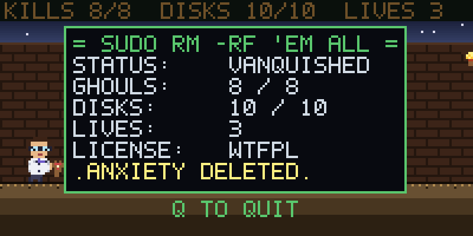

# RM -RF 'EM ALL

A goofy 8-bit pixel-art side-scroller, now in a real pygame window.
Crisp nearest-neighbor scaled pixels, a blinking splash screen, a
**runtime-generated chiptune**, and developer humor instead of taste.
You play a nerd in a lab coat with a slingshot. Red ghouls shamble in
from both sides. You pelt them.

(Earlier versions ran entirely inside a terminal using half-block ANSI
pixels. v0.7 ported to pygame so we get real key-up events, simultaneous
keys, and Linux/Windows portability — the controls are finally correct.)

## Screenshots

### Splash screen

(With an obnoxious square-wave theme song playing on a loop. Press ENTER
to start the game and mercifully end the music.)


*(Rendered straight from the in-game framebuffer, then upscaled 4x with
nearest-neighbor so the pixels stay sharp. In the real game the prompt
blinks; this is a static snapshot.)*

### In-game

Side-scrolling pixel diorama: lab-coat nerd mid-jump over a pit,
ghouls closing in from **both sides**, RAPID powerup glowing on the
ground, floppy-disk pickups scattered around, torchlit brick corridor,
slingshot pellet mid-flight. The world is several screens wide and the
camera follows the player.


*(Same source: real framebuffer output, 4x nearest-neighbor upscale.
The actual game renders the same internal 160x80 surface scaled up 6x
to a 960x480 pygame window.)*

### End-of-level certificate

Kill all 8 ghouls AND walk to the right edge of the level and you get
a fake-terminal certificate of root access:



## What it is

A pygame pixel-art side-scroller across **three themed levels** --
brick corridor, server room, deep-terminal phosphor green. Each level
ends with a fight against the **OVERLORD**, who drops a golden **SSL
cert** when killed. Walk over the cert to advance to the next level
(or, on the final level, to claim the certificate of root access).
Along the way: crate stacks to jump on/over, **pits** to leap over
(or fall into and respawn), **floppy disks** to collect, and a
**delivery drone** that buzzes in from off-screen with a weapon crate
(RAPID / SPREAD / PIERCE) any time you kill a ghoul.

## Requirements

- **Python 3.8+**
- **pygame 2.5+** (`pip3 install pygame` or `pip3 install -r requirements.txt`)
- macOS, Linux, or Windows -- anywhere pygame runs.

## Run

```bash
pip3 install -r requirements.txt
python3 game.py            # fullscreen by default
python3 game.py --windowed # 960x480 window
```

The internal canvas stays at 160x80 and pygame nearest-neighbor scales
to whatever your display is. **F11** toggles fullscreen at any time.
On first launch the game synthesizes a ~11-second palm-muted tritone
riff (square wave + power-chord fifth, E2 root, ~176 bpm gallop) plus
the SFX bleeps to your temp dir; the theme loops on the splash. Press
**ENTER** to start (music stops), or **Q** / close the window to
chicken out.

## Controls

| Key                | Action                |
|--------------------|-----------------------|
| `Left` / `Right` (or `A` / `D`) | Walk left / right  |
| `Space`            | Jump                  |
| `X`                | Shoot slingshot       |
| `F11`              | Toggle fullscreen     |
| `Q` or `Esc`       | Quit                  |
| `Up`               | (reserved for future ladders / vertical movement) |

## How to win

Kill every ghoul (`X` to fire), then put down the **OVERLORD** that
arrives near the end of the level, then walk over the **golden SSL
cert** it drops to advance to the next level. Three levels total --
clear the third and you get the goofy "root access granted"
certificate. Watch your footing (pits = bad). Grab floppy disks for
completionist nerd points. Killed ghouls sometimes summon a buzzing
delivery drone that drops a Contra-style weapon crate:

| Crate    | Effect                              |
|----------|-------------------------------------|
| `RAPID`  | Slingshot cooldown halved for 8 s   |
| `SPREAD` | Three pellets per shot (fan)        |
| `PIERCE` | Pellet keeps going through enemies  |

## How to uninstall

```bash
rm -rf rm-rf-em-all
```

(The project literally rm -rf's itself. The name was a promise.)

## Status

**v0.9** -- three themed **levels** (BRICK CORRIDOR -> SERVER ROOM ->
DEEP TERMINAL) with palette swaps that retint the walls, ground, sky,
and the ghouls themselves (red -> cyan -> phosphor green). Each level
ends with the OVERLORD; killing the boss now drops a **golden SSL
cert** that you walk over to advance (or to win the game on level 3) --
much clearer end-of-level signal than 'walk to the right edge.' Each
weapon kind (`RAPID`, `SPREAD`, `PIERCE`) now has its own crate sprite
instead of a uniform yellow box with a letter on top. Delivery drones
also got a continuous buzzing **propeller sound** that loops while
they're on screen and stops when they leave, so you actually hear
them coming.

Bug fixes:
- Boss hit detection was only registering ~1 in 30 shots due to a
  CPython id() reuse issue (target hit_set's still contained ids of
  GC'd pellets that got reassigned to fresh ones). Fixed by tracking
  hit-state on the pellet (short-lived) instead of on the target.
- Drone sprite redesigned as a proper 12x6 quadcopter with rotors top
  and bottom, plus a sine-bob so it visibly flies rather than glides.

**v0.8** -- fullscreen by default (F11 toggles), an end-of-level
**boss** (the OVERLORD: a 2x-scale purple-tinted ghoul with 8 HP and
a phosphor HP bar at the top of the screen), and **drone-delivered
weapon crates**. Killed ghouls have a 30% chance of summoning a small
mechanical delivery drone that flies in from off-screen, hovers, drops
a weapon crate, and flies off the other way. Crates fall under
gravity, land on the nearest surface, and grant `RAPID` /
`SPREAD` / `PIERCE` for 8 seconds when picked up. Pellets render
differently per weapon (red core for PIERCE; three-pellet fan for
SPREAD). Win condition is now: kill 8 ghouls AND kill the OVERLORD AND
walk to the right edge.

**v0.7** -- ported from terminal stdin to a real pygame window. Real
key-up events make the controls trivially correct: held = walk,
released = stop. All the workaround machinery from v0.4-v0.6
(`MOVE_HOLD_S`, `air_dir`, jump-intent windows, action-grace carry
helpers) is gone. SFX are now synthesized procedurally at first
launch (square-wave bleeps + a noise burst for kills), and the theme
loops via `pygame.mixer.music`. Internal pixel res stays at 160x80
(so all the existing sprites and level gen Just Work) and the window
is a 6x nearest-neighbor scale (960x480) for crisp pixels. macOS,
Linux, and Windows now all work via `pip install pygame`.

**v0.6** -- snappier controls, smarter ghouls. Bumped target FPS from
30 to 60 so input poll rate doubles and motion smooths out, refactored
all physics to be framerate-independent (use `dt` instead of per-tick
constants), increased walk speed by ~2x and jump arc clears 2-stack
crates with comfortable margin. Tightened the ESC-sequence wait in the
input reader from 30 ms to 5 ms, cutting per-frame input latency.
Ghouls now **block on crates and pits** -- they reverse direction
instead of walking through cover or falling into the abyss -- and can
**spawn from either side** of the camera so you have to actually
watch your back. Sprites flip to face the direction they're walking.

**v0.5** -- the level actually feels like a level. Added **pits** in
the floor (fall in, lose a life, respawn at the last safe ground tile),
**floppy disk** pickups scattered along the world (some hovering over
gaps as a jump-bait reward), a single one-shot **RAPID-fire powerup**
that halves the slingshot cooldown for 8 seconds, and a goofy
**phosphor-green "root access granted" certificate** at the end of the
level. Win condition is now: kill all 8 ghouls AND walk to the right
edge. Controls also shifted to NES/SNES platformer convention --
**SPACE = jump** (was Up arrow), **X = shoot** (was Space). Up arrow
is now reserved for future ladders / vertical movement.

**v0.4** -- pivoted from raycaster-FPS to **8-bit pixel-art
side-scroller**. Renders to a half-block-pixel framebuffer with truecolor
fg/bg per cell (effectively 2x vertical resolution per terminal row).
New protagonist: a nerd in a **lab coat** with glasses and a slingshot.
Enemies are red ghouls that shamble in from the right. Splash screen is
also pixel art (fire-gradient title, skull at larger sizes, CRT
scanlines). The nerd can **jump** (Up arrow) to clear ghouls. Movement
also got smoother: each LEFT/RIGHT press now extends a brief "still
held" window so walking is continuous through the OS auto-repeat
pre-delay instead of stuttering. The world is now several screens wide
with a scrolling camera and randomly-placed **crate stacks** to jump
on or over -- tall stacks make handy elevated firing positions.

**v0.3** -- DDA raycaster (render was ~0.8ms per frame at 80x24), arrow
keys drained per frame so inputs stop queueing up, and the theme got a
lobotomy: dropped an octave to E2, switched to palm-muted sixteenth-note
gallops with tritone stabs and power-chord fifths for something that at
least *rhymes* with death metal.

**v0.2** -- color rendering, arrow-key controls, animated splash screen,
and a runtime-generated chiptune theme.
