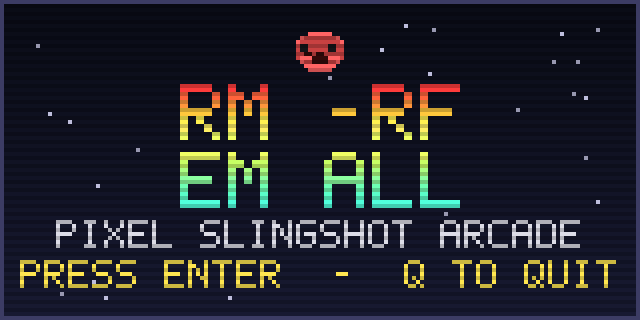
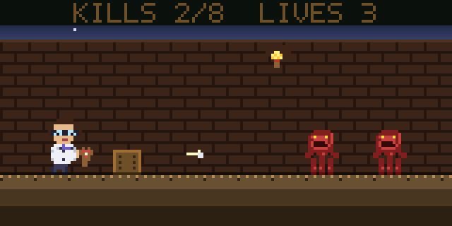

# RM -RF 'EM ALL

A goofy 8-bit pixel-art side-scroller that runs entirely in your terminal.
Half-block ANSI truecolor pixels, a blinking splash screen, a
**runtime-generated chiptune**, and developer humor instead of taste.
You play a nerd with glasses and a slingshot. Red ghouls shamble in.
You pelt them.

## Screenshots

### Splash screen

(With an obnoxious square-wave theme song playing on a loop. Press ENTER
to start the game and mercifully end the music.)



*(Rendered straight from the in-game framebuffer, then upscaled 4x with
nearest-neighbor so the pixels stay sharp. In your real terminal the
prompt also blinks; this is a static snapshot.)*

### In-game

Side-view diorama: nerd in a lab coat on the left, two red ghouls on
the right, brick corridor with a torch and a crate, slingshot pellet
mid-flight.



*(Same source: real framebuffer output, 4x nearest-neighbor upscale.
The actual game renders this scene live in your terminal using
upper-half-block characters with truecolor fg/bg per cell, doubling the
vertical pixel resolution.)*

## What it is

A pure-stdlib Python pixel-art side-scroller. One screen, ghouls walk in
from the right, you shoot a slingshot pellet straight at them. Color
rendering via ANSI truecolor + `▀` half-block characters, plus a pile of
dumb taunts. Crude on purpose.

## Requirements

- **macOS** (uses `afplay` for sound effects and theme music -- zero install)
- **Python 3.8+**
- A terminal at least **40 cols x 15 rows** (80x24+ recommended)
- A terminal with ANSI truecolor support (Terminal.app, iTerm2, Ghostty all work)

## Run

```bash
python3 game.py
```

On first launch the game generates an ~11-second palm-muted tritone riff
(square wave + power-chord fifth, E2 root, ~176 bpm gallop) in your temp
dir and loops it during the splash. Press **ENTER** to start the game
(music stops), or **Q** to chicken out.

## Controls

| Key           | Action                |
|---------------|-----------------------|
| `Left` / `Right` | Walk left / right  |
| `Up`          | Jump                  |
| `Space`       | Shoot slingshot       |
| `Q`           | Quit                  |

## How to win

Kill every enemy before they touch you. That's the whole game.

## How to uninstall

```bash
rm -rf em-all
```

(It is literally in the name.)

## Status

**v0.4** -- pivoted from raycaster-FPS to **8-bit pixel-art
side-scroller**. Renders to a half-block-pixel framebuffer with truecolor
fg/bg per cell (effectively 2x vertical resolution per terminal row).
New protagonist: a nerd in a **lab coat** with glasses and a slingshot.
Enemies are red ghouls that shamble in from the right. Splash screen is
also pixel art (fire-gradient title, skull at larger sizes, CRT
scanlines). The nerd can **jump** (Up arrow) to clear ghouls. Movement
also got smoother: each LEFT/RIGHT press now extends a brief "still
held" window so walking is continuous through the OS auto-repeat
pre-delay instead of stuttering.

**v0.3** -- DDA raycaster (render was ~0.8ms per frame at 80x24), arrow
keys drained per frame so inputs stop queueing up, and the theme got a
lobotomy: dropped an octave to E2, switched to palm-muted sixteenth-note
gallops with tritone stabs and power-chord fifths for something that at
least *rhymes* with death metal.

**v0.2** -- color rendering, arrow-key controls, animated splash screen,
and a runtime-generated chiptune theme.
