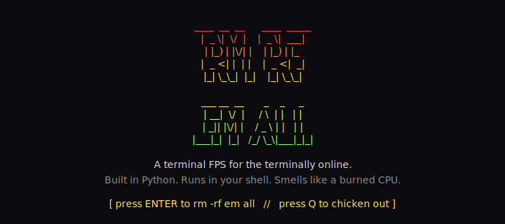
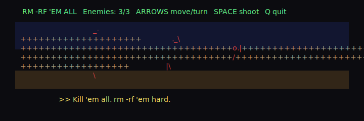

# RM -RF 'EM ALL

A goofy first-person shooter that runs entirely in your terminal.
Wolfenstein 3D rendered in **color ASCII**, with a blinking splash screen,
a **runtime-generated 8-bit chiptune**, and developer humor instead of taste.

## Screenshots

### Splash screen

(With an obnoxious square-wave theme song playing on a loop. Press ENTER
to start the game and mercifully end the music.)



*(In your real terminal the bottom prompt also blinks; this is a static snapshot.)*

### In-game

Close-up on an enemy down the hall. Crosshair is the `+`, the enemy's
sprite is the little pile of punctuation in the middle, and the walls get
denser (`.` -> `+` -> `%` -> `#`) as they get closer.



*(Walls are tan, ceiling blue-grey, floor brown, enemy red, HUD green,
taunt yellow. The real game shades walls and enemies by distance.)*

## What it is

A minimal raycaster in pure-stdlib Python. One room, a few enemies that
shuffle toward you, one gun with infinite ammo, color rendering via ANSI
truecolor, and a pile of dumb taunts. Crude on purpose.

## Requirements

- **macOS** (uses `afplay` for sound effects and theme music -- zero install)
- **Python 3.8+**
- A terminal at least **40 cols x 15 rows** (80x24+ recommended)
- A terminal with ANSI truecolor support (Terminal.app, iTerm2, Ghostty all work)

## Run

```bash
python3 game.py
```

On first launch the game generates an ~11-second palm-muted tritone riff
(square wave + power-chord fifth, E2 root, ~176 bpm gallop) in your temp
dir and loops it during the splash. Press **ENTER** to start the game
(music stops), or **Q** to chicken out.

## Controls

| Key           | Action                |
|---------------|-----------------------|
| `Up` / `Down` | Forward / backward    |
| `Left` / `Right` | Turn left / right  |
| `Space`       | Shoot                 |
| `Q`           | Quit                  |

## How to win

Kill every enemy before they touch you. That's the whole game.

## How to uninstall

```bash
rm -rf em-all
```

(It is literally in the name.)

## Status

**v0.3** -- DDA raycaster (render is ~40x faster, ~0.8ms per frame at
80x24), arrow keys drained per frame so inputs stop queueing up, and the
theme got a lobotomy: dropped an octave to E2, switched to palm-muted
sixteenth-note gallops with tritone stabs and power-chord fifths for
something that at least *rhymes* with death metal.

**v0.2** -- color rendering, arrow-key controls, animated splash screen,
and a runtime-generated chiptune theme.
